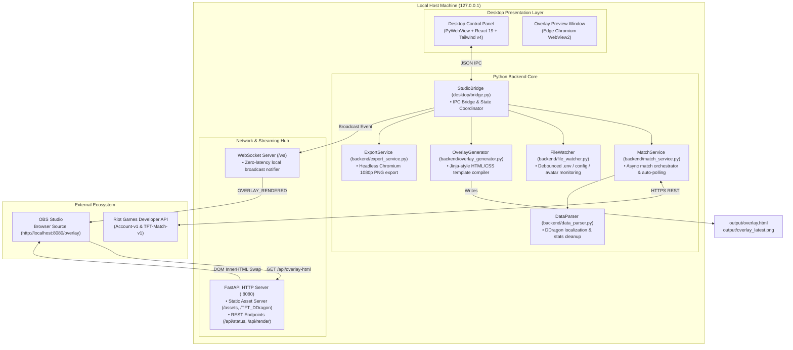

<div align="center">

# ⚔️ TFT Post-Match Studio

**Production-ready Post-Match Esports Broadcast Overlay & Live Companion for Teamfight Tactics (TFT)**

Connect to the Riot Games API, process real-time match data, and broadcast broadcast-grade 1080p overlays directly into OBS Studio with zero reload flicker.

[](LICENSE)
[](https://www.python.org/)
[](https://fastapi.tiangolo.com/)
[](https://react.dev/)
[](https://tailwindcss.com/)
[](https://vitejs.dev/)
[](https://obsproject.com/)
[](https://github.com/triphung-git/Teamfight-Tactics_Overlay)

[ 🇬🇧 English ](README.md) • [ 🇻🇳 Tiếng Việt ](README.vn.md)

</div>

---

## 📑 Table of Contents

- [Overview](#-overview)
- [Key Features](#-key-features)
- [System Architecture](#️-system-architecture)
- [Tech Stack](#-tech-stack)
- [Project Structure](#-project-structure)
- [Quick Start Guide](#-quick-start-guide)
  - [Prerequisites](#prerequisites)
  - [Installation from Source](#installation-from-source)
  - [Portable / Installer Setup](#portable--installer-setup)
- [Configuration](#-configuration)
  - [Environment Variables (.env)](#environment-variables-env)
  - [Overlay Configuration (overlay_config.json)](#overlay-configuration-overlay_configjson)
- [OBS Studio Integration](#-obs-studio-integration)
- [REST API & WebSocket Protocol](#-rest-api--websocket-protocol)
- [Build & Packaging](#-build--packaging)
- [Troubleshooting](#-troubleshooting)
- [Contributing](#-contributing)
- [Legal Disclaimer](#-legal-disclaimer)
- [License](#-license)

---

## 🌟 Overview

**TFT Post-Match Studio** is an open-source, broadcast-oriented studio overlay solution designed for esports tournament organizers, casters, and streamers. 

In competitive TFT tournaments, displaying post-match lobbies, player placements, units, items, and augments manually is slow, error-prone, and visually inconsistent. This studio automates the entire pipeline:
1. **Pulls official match telemetry** directly from the Riot Games API within seconds of match conclusion.
2. **Translates raw game identifiers** (champions, traits, items, augments) via an offline Data Dragon database.
3. **Pushes instant updates to OBS Studio** via a local WebSocket connection utilizing a seamless DOM-swap technique (no page refresh, no black frames, no stream flicker).
4. **Operates 100% locally** on the host machine without external database dependencies or cloud hosting fees.

---

## ✨ Key Features

- **⚡ Official Riot Games API Integration**:
  - Resolves Summoner PUUID and fetches recent TFT match records automatically.
  - Built-in token-bucket rate limiter ensuring zero `429 Too Many Requests` bans.
  - Multi-region routing support: SEA (`VN`, `SG`, `TW`, `TH`, `PH`), Asia (`KR`, `JP`), Americas (`NA`, `BR`, `LAN`, `LAS`, `OCE`), Europe (`EUW`, `EUNE`, `TR`, `RU`).

- **📺 Broadcast-Grade OBS Overlay (1920×1080)**:
  - Pixel-perfect HTML5/CSS3 esports broadcast layout (custom-tailored for HOSC and competitive tournaments).
  - **Zero-Flicker Real-time Updates**: Pushes WebSocket notifications triggering seamless DOM-swapping with hardware-accelerated CSS fade animations.
  - Support for custom tournament headers, stage indicators, player avatars, and stage titles.

- **🎛️ Modern Desktop Control Panel**:
  - Embedded desktop application powered by **PyWebView** and Microsoft Edge WebView2.
  - Frontend built with **React 19**, **Tailwind CSS v4**, and **Lucide Icons**.
  - In-app Live Tracker: Update Riot ID on the fly, monitor API quota, toggle auto-polling, and trigger immediate manual renders.

- **🧬 Augments Selector & DDragon Localization**:
  - Visual selector for Hextech Augments (Silver, Gold, Prismatic) with search and English/Vietnamese names.
  - Comprehensive Data Dragon cache supporting active sets, champions, traits, items, and tacticians.

- **📸 Headless Chrome PNG Rendering**:
  - Instant generation of 1080p high-resolution PNG snapshots via Headless Chromium/Edge for quick social media posting.

- **📂 Live File Watcher**:
  - Automatically re-renders overlays upon saving `overlay_config.json`, editing `.env`, or dropping new player avatar photos into `assets/avatars/`.

- **🔒 Standalone & Privacy-Preserving**:
  - Binds strictly to `localhost` (`127.0.0.1:8080`). Your Riot API Key and configuration remain solely on your local device.

---

## 🏗️ System Architecture



### Event Sequence

1. **Trigger**: User clicks **Render** in the Control Panel (or FileWatcher detects a file change).
2. **Fetch & Clean**: `MatchService` queries Riot API (or loads latest local cache), runs through `DataParser` against local `TFT_DDragon` definitions.
3. **Compile**: `OverlayGenerator` writes fresh DOM markup to `output/overlay.html`.
4. **Notify**: `NetworkHub` broadcasts an `OVERLAY_RENDERED` event across the local WebSocket channel.
5. **Seamless Swap**: Connected OBS Browser Sources fetch `/api/overlay-html` and perform a smooth, opacity-faded DOM swap without reloading the browser window.

---

## 💻 Tech Stack

| Domain | Technologies | Details |
|---|---|---|
| **Backend & Core** | Python 3.10+, FastAPI, Uvicorn, WebSockets | Asynchronous event loop, high-performance local server |
| **Desktop Runtime** | PyWebView 6.0+, Microsoft Edge WebView2 | Lightweight native Windows desktop shell, zero Electron overhead |
| **Frontend UI** | React 19, TypeScript, Vite 8, Tailwind CSS v4 | High-performance control panel with modern glassmorphism aesthetic |
| **UI Components** | Lucide React, vite-plugin-singlefile | Vector icons, single-bundle distribution capability |
| **Data & Game Assets** | Riot Games API, Data Dragon (Set 18+) | Multi-regional routing, offline champion & augment assets |
| **Broadcasting** | OBS Studio Browser Source, Chromium Headless | 1920×1080 60fps real-time DOM-swap & PNG screenshot generation |
| **Packaging & CI** | PyInstaller 6.5+, Inno Setup 6 | Single executable bundle and Windows setup wizard |

---

## 🗂️ Project Structure

```text
Teamfight-Tactics_Overlay/
├── backend/                        # Python backend logic & services
│   ├── config.py                   # AppConfig dataclass & region router mapping
│   ├── data_parser.py              # DDragon parser, raw-to-clean match transform
│   ├── export_service.py           # Headless Chrome/Edge PNG screenshot exporter
│   ├── file_watcher.py             # Debounced file system watcher for live hot-reload
│   ├── match_service.py            # Riot API coordinator & background polling thread
│   ├── network_hub.py              # FastAPI server, static mounts & WebSocket hub
│   ├── overlay_generator.py        # 1080p HTML overlay template compiler
│   ├── paths.py                    # Unified path resolution (Dev vs PyInstaller bundle)
│   └── riot_client.py              # Thread-safe Riot API HTTP client with rate limiter
├── desktop/                        # Desktop wrapper & IPC
│   ├── app.py                      # Application entrypoint & PyWebView window manager
│   ├── bridge.py                   # Bidirectional IPC bridge (Python ↔ React)
│   └── local_server.py             # Server bootstrapper
├── Web Overlay/                    # Frontend React control panel
│   ├── src/
│   │   ├── components/             # React control components (SourceTransformPanel, etc.)
│   │   ├── App.tsx                 # Root application component
│   │   ├── index.css               # Tailwind CSS v4 imports & theme variables
│   │   └── main.tsx                # React DOM entrypoint
│   ├── package.json                # Node.js dependencies & build scripts
│   └── vite.config.ts              # Vite 8 build pipeline
├── templates/                      # Overlay HTML/CSS templates
│   ├── overlay.html                # Base tournament overlay HTML skeleton
│   └── overlay.css                 # 1080p broadcast layout & animation stylesheets
├── assets/                         # Tournament branding & graphical assets
│   ├── League_Spartan/             # Bundled typography
│   ├── avatars/                    # Custom player portrait overrides
│   ├── app_icon.ico                # Application executable icon
│   └── background.png              # Default 1080p tournament backdrop
├── TFT_DDragon/                    # Riot Data Dragon game assets (offline cache)
│   ├── data/                       # Multilingual JSON definitions (vi_VN, en_US)
│   └── img/                        # Champions, traits, items, augments, tacticians
├── output/                         # Generated artifacts (overlay.html, PNG snapshots, cache)
├── .env.example                    # Environment template for Riot API credentials
├── overlay_config.json             # Tournament branding & augment configuration
├── requirements.txt                # Python runtime dependencies
├── studio.spec                     # PyInstaller specification for single-folder/exe build
├── installer.iss                   # Inno Setup 6 compilation script for Windows installer
├── build_exe.bat / build_exe.ps1   # Automated one-click packaging scripts
└── run_app.bat / run_app.ps1       # One-click launch scripts
```

---

## ⚡ Quick Start Guide

### Prerequisites

- **OS**: Windows 10 or Windows 11 (64-bit).
- **Python**: Version 3.10 or higher ([python.org](https://www.python.org/downloads/)).
- **Node.js**: Version 18 or higher ([nodejs.org](https://nodejs.org/)).
- **OBS Studio**: Version 28 or higher ([obsproject.com](https://obsproject.com/)).
- **Microsoft WebView2 Runtime**: Pre-installed on modern Windows 10/11 (or downloadable via [Microsoft](https://developer.microsoft.com/en-us/microsoft-edge/webview2/)).

---

### Installation from Source

#### 1. Clone the repository
```bash
git clone https://github.com/triphung-git/Teamfight-Tactics_Overlay.git
cd Teamfight-Tactics_Overlay
```

#### 2. Set up Python virtual environment
```bash
python -m venv .venv
# Activate on Windows (cmd/PowerShell)
.venv\Scripts\activate
# Install dependencies
pip install -r requirements.txt
```

#### 3. Build the Frontend UI
```bash
cd "Web Overlay"
npm install
npm run build
cd ..
```

#### 4. Configure credentials
```bash
# Create .env from template
copy .env.example .env
```
Open `.env` and provide your Riot API Key and Riot ID:
```env
RIOT_API_KEY=RGAPI-xxxxxxxx-xxxx-xxxx-xxxx-xxxxxxxxxxxx
RIOT_ID=YourName#TAG
REGION=VN
```

#### 5. Launch the application
```bash
python -m desktop.app
```
*Or execute the pre-configured script:*
```bash
run_app.bat
# or PowerShell:
.\run_app.ps1
```

---

### Portable / Installer Setup

If you build or download the pre-packaged release:
1. Run `dist_setup/TFT_Studio_Setup.exe` to install to your machine, or extract the portable folder from `dist/TFT_PostMatch_Studio/`.
2. Launch `TFT_PostMatch_Studio.exe`.
3. Open the **Control Panel** window, input your Riot API Key directly in the UI, and you are ready to render.

---

## ⚙️ Configuration

### Environment Variables (`.env`)

| Variable | Type | Default | Description | Example |
|---|---|---|---|---|
| `RIOT_API_KEY` | `string` | *(required)* | API Key from [Riot Developer Portal](https://developer.riotgames.com). | `RGAPI-ab12-cd34-...` |
| `RIOT_ID` | `string` | *(required)* | In-game player identity in `GameName#TagLine` format. | `Faker#KR1` |
| `REGION` | `string` | `VN` | Server platform/region routing code. | `VN`, `KR`, `NA`, `EUW` |
| `MATCH_COUNT` | `integer` | `5` | Number of recent matches to fetch and parse (1–20). | `5` |
| `LANGUAGE` | `string` | `vi_VN` | DDragon translation dictionary for items/traits. | `vi_VN` or `en_US` |
| `OUTPUT_DIR` | `string` | `output` | Directory where HTML and PNG artifacts are saved. | `output` |

> ℹ️ **Notice on Riot Development API Keys:**
> Personal Development Keys expire every **24 hours**. When expired, simply generate a new key on the [Riot Developer Dashboard](https://developer.riotgames.com/) and update it through the desktop Control Panel or by editing `.env`.

---

### Overlay Configuration (`overlay_config.json`)

```json
{
  "tournament_title": "HOSC 2026 | TEAMFIGHT TACTICS",
  "stage_title": "BRACKET STAGE",
  "game_title": "GRAND FINALS",
  "server_port": 8080,
  "background_image": "assets/background.png",
  "font_family": "League Spartan",
  "player_avatars": {
    "PlayerOne#VN2": "assets/avatars/player_one.png"
  },
  "custom_augments": [
    "QuestForTheSeven_II.png",
    "AnimaCommander_II.png",
    "ThreeThrees_II.png"
  ]
}
```

- **`tournament_title`**: Main title displayed on the upper broadcast banner.
- **`stage_title`**: Sub-banner description (e.g., *Group Stage*, *Semi-Finals*).
- **`player_avatars`**: Map player summoner names or Riot IDs to custom avatar images stored in `assets/avatars/`. If unassigned, the system gracefully falls back to the player's in-game Little Legend (Tactician).
- **`custom_augments`**: Array of 3 augment image filenames. If set, overrides the match augment data. If set to `null` or left empty, uses actual match augment telemetry.

---

## 📺 OBS Studio Integration

Follow these steps to link the live overlay to your streaming scenes:

1. Launch **OBS Studio**.
2. Under **Sources**, click **`+` (Add Source)** and select **Browser**.
3. Configure the Browser Source settings:
   - **URL**: `http://localhost:8080/overlay`
   - **Width**: `1920`
   - **Height**: `1080`
   - **FPS**: `60` (or `30`)
   - ✅ Check **Shutdown source when not visible**
   - ✅ Check **Refresh browser when scene becomes active**
4. Click **OK**.
5. When you click **Render** in the desktop Control Panel, OBS will automatically receive the updated scoreboard without page refreshes or blinking frames.

```
+-------------------------------------------------------------------+
|  OBS Studio Canvas (1920x1080)                                    |
|                                                                   |
|   +-----------------------------------------------------------+   |
|   |  TOURNAMENT BANNER: HOSC 2026 | BRACKET STAGE             |   |
|   +-----------------------------------------------------------+   |
|                                                                   |
|   [Top 1] Player A  ★3 Unit [Item][Item][Item]  Augments: [A][B][C] |
|   [Top 2] Player B  ★2 Unit [Item][Item]        Augments: [A][B][C] |
|   [Top 3] Player C  ★2 Unit [Item][Item][Item]  Augments: [A][B][C] |
|   ...                                                             |
|   [Top 8] Player H  ★1 Unit [Item]              Augments: [A][B][C] |
+-------------------------------------------------------------------+
```

---

## 🔌 REST API & WebSocket Protocol

When running, the application hosts a local HTTP server at `http://127.0.0.1:8080`.

### REST Endpoints

| Method | Endpoint | Description |
|---|---|---|
| `GET` | `/api/status` | Heartbeat endpoint returning service status and client URLs. |
| `GET` | `/api/state` | Retrieves entire application state (cached matches, active match, configs). |
| `POST` | `/api/render` | Programmatically triggers an overlay compilation and sync event. |
| `GET` | `/api/config` | Reads the current `overlay_config.json`. |
| `POST` | `/api/config` | Updates tournament config and broadcasts the change via WebSocket. |
| `GET` | `/api/riot` | Returns current masked Riot ID and API key status. |
| `POST` | `/api/riot/fetch` | Triggers an immediate asynchronous Riot API query for the active player. |
| `GET` | `/api/augments` | Returns list of all Hextech Augments sorted alphabetically from DDragon. |
| `POST` | `/api/augments` | Saves 3 custom augment overrides and triggers instant recompilation. |
| `GET` | `/api/overlay-html` | Returns inner HTML body content of `overlay.html` for DOM-swapping. |
| `GET` | `/overlay` | Main endpoint loaded by OBS Studio Browser Source. |
| `GET` | `/overlay.css` | Serves compiled CSS stylesheet. |
| `GET` | `/overlay_latest.png` | Serves the latest high-resolution 1080p rendered PNG snapshot. |

### WebSocket Protocol (`/ws`)

Connect to `ws://127.0.0.1:8080/ws` to receive real-time push events:

- **`INITIAL_STATE`**: Dispatched upon connection with current configurations.
- **`OVERLAY_RENDERED`**: Dispatched whenever a match is rendered. Carries `{ "match_id": "...", "timestamp": ... }`.
- **`CONFIG_CHANGED`**: Dispatched when `overlay_config.json` changes.
- **`PING`**: Periodic keepalive ping.

---

## 📦 Build & Packaging

You can package the entire application into a standalone Windows executable (`.exe`) with no runtime dependencies on Python or Node.js.

### One-Click Packaging

Run the provided Windows batch or PowerShell script:

```bat
build_exe.bat
```
*or via PowerShell:*
```powershell
.\build_exe.ps1
```

### Manual Build Steps

1. **Compile React Bundle**:
   ```bash
   cd "Web Overlay"
   npm run build
   cd ..
   ```

2. **Generate Application Executable (PyInstaller)**:
   ```bash
   pyinstaller --clean -y studio.spec
   ```
   *Output directory:* `dist/TFT_PostMatch_Studio/TFT_PostMatch_Studio.exe`

3. **Build Windows Installer (Inno Setup)**:
   If Inno Setup 6 is installed, compile `installer.iss`:
   ```bash
   "C:\Program Files (x86)\Inno Setup 6\ISCC.exe" installer.iss
   ```
   *Output installer:* `dist_setup/TFT_Studio_Setup.exe`

---

## 🛠️ Troubleshooting

| Issue | Root Cause | Solution |
|---|---|---|
| **Riot API 401 / 403 Forbidden** | API Key is expired, invalid, or malformed. | Visit [developer.riotgames.com](https://developer.riotgames.com), regenerate your key, and paste it into the Control Panel or `.env`. |
| **Riot API 404 Account Not Found** | Incorrect Game Name or Tagline. | Ensure format matches exactly: `GameName#TAG` (e.g., `Faker#KR1`). Double-check spelling and region. |
| **Riot API 429 Rate Limit Exceeded** | Calling the API too frequently. | The built-in client automatically backs off. Wait a minute or reduce `MATCH_COUNT`. |
| **OBS Overlay shows blank or black** | Server not running or overlay not rendered. | Launch `run_app.bat`, click **Render** in the Control Panel, and confirm `http://localhost:8080/overlay` loads in your web browser. |
| **Control Panel fails to open** | Missing Microsoft WebView2 runtime. | Download and install the [Microsoft Edge WebView2 Evergreen Bootstrapper](https://developer.microsoft.com/en-us/microsoft-edge/webview2/). |
| **PNG Export Failed** | Headless Chrome/Edge executable not found. | Ensure Google Chrome or Microsoft Edge is installed in default Program Files directories. |
| **Font rendering issues** | Missing font assets. | Verify `assets/League_Spartan/` contains the bundled `.ttf` font files. |

---

## 🤝 Contributing

Contributions from the community are warmly welcome! Whether you are submitting a bug fix, new overlay themes, or translations:

1. **Fork the Repository**: Click `Fork` on GitHub.
2. **Create a Feature Branch**:
   ```bash
   git checkout -b feat/custom-overlay-theme
   ```
3. **Commit Changes**: Follow [Conventional Commits](https://www.conventionalcommits.org/):
   ```bash
   git commit -m "feat(overlay): add support for custom scoreboard layouts"
   ```
4. **Push to GitHub**:
   ```bash
   git push origin feat/custom-overlay-theme
   ```
5. **Open a Pull Request**: Submit your PR with a concise description of changes and test steps.

---

## 📜 Legal Disclaimer

**TFT Post-Match Studio** is an unofficial community project and is not endorsed by, directly affiliated with, maintained, authorized, or sponsored by Riot Games, Inc.

Teamfight Tactics, League of Legends, and Riot Games are trademarks or registered trademarks of Riot Games, Inc. in the U.S. and/or other countries. All game assets, artwork, champion icons, item imagery, and Data Dragon resources remain the intellectual property of Riot Games.

---

## 📄 License

Distributed under the **MIT License**. See [`LICENSE`](LICENSE) for complete terms and copyright notices.

```
Copyright (c) 2026 TFT Post-Match Studio Contributors
```

<div align="center">
  <sub>Engineered with precision for the global Teamfight Tactics broadcast community.</sub>
</div>
