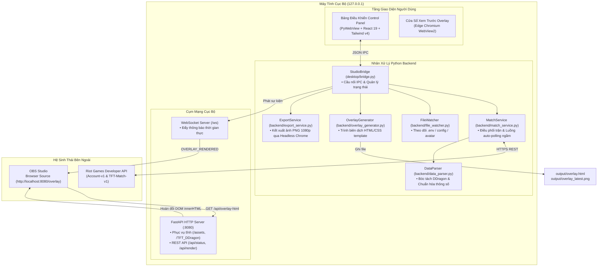

<div align="center">

# ⚔️ TFT Post-Match Studio

**Phần mềm tạo Overlay Hậu Trận Đấu & Trợ Lý Trực Tiếp Cho Esports Teamfight Tactics (TFT)**

Kết nối Riot Games API, bóc tách dữ liệu trận đấu thời gian thực và phát trực tiếp overlay đồ họa chuẩn 1080p lên OBS Studio với công nghệ chuyển cảnh mượt mà không nhấp nháy (zero-flicker).

[](LICENSE)
[](https://www.python.org/)
[](https://fastapi.tiangolo.com/)
[](https://react.dev/)
[](https://tailwindcss.com/)
[](https://vitejs.dev/)
[](https://obsproject.com/)
[](https://github.com/triphung-git/Teamfight-Tactics_Overlay)

[ 🇬🇧 English ](README.md) • [ 🇻🇳 Tiếng Việt ](README.vn.md)

</div>

---

## 📑 Mục Lục

- [Tổng Quan Dự Án](#-tổng-quan-dự-án)
- [Tính Năng Nổi Bật](#-tính-năng-nổi-bật)
- [Kiến Trúc Hệ Thống](#️-kiến-trúc-hệ-thống)
- [Công Nghệ Sử Dụng](#-công-nghệ-sử-dụng)
- [Cấu Trúc Thư Mục](#-cấu-trúc-thư-mục)
- [Hướng Dẫn Cài Đặt Nhanh](#-hướng-dẫn-cài-đặt-nhanh)
  - [Yêu Cầu Tiên Quyết](#yêu-cầu-tiên-quyết)
  - [Cài Đặt Từ Mã Nguồn](#cài-đặt-từ-mã-nguồn)
  - [Sử Dụng Bản Đóng Gói (Installer / Portable)](#sử-dụng-bản-đóng-gói-installer--portable)
- [Hướng Dẫn Cấu Hình](#-hướng-dẫn-cấu-hình)
  - [Biến Môi Trường (.env)](#biến-môi-trường-env)
  - [Cấu Hình Overlay (overlay_config.json)](#cấu-hình-overlay-overlay_configjson)
- [Tích Hợp OBS Studio](#-tích-hợp-obs-studio)
- [Giao Thức REST API & WebSocket](#-giao-thức-rest-api--websocket)
- [Đóng Gói & Xuất Bản (.exe)](#-đóng-gói--xuất-bản-exe)
- [Xử Lý Sự Cố (Troubleshooting)](#-xử-lý-sự-cố-troubleshooting)
- [Đóng Góp Phát Triển](#-đóng-góp-phát-triển)
- [Tuyên Bố Miễn Trừ Bản Quyền](#-tuyên-bố-miễn-trừ-bản-quyền)
- [Giấy Phép Bản Quyền](#-giấy-phép-bản-quyền)

---

## 🌟 Tổng Quan Dự Án

**TFT Post-Match Studio** là giải pháp phần mềm mã nguồn mở tạo đồ họa Overlay bảng xếp hạng hậu trận đấu chuyên nghiệp dành cho ban tổ chức giải đấu esports, bình luận viên (caster) và streamer tựa game Đấu Trường Chân Lý (Teamfight Tactics - TFT).

Trong các giải đấu TFT, việc nhập thủ công thứ hạng 8 người chơi, tướng 3 sao, trang bị và lõi nâng cấp lên overlay phát sóng thường mất nhiều thời gian, dễ nhầm lẫn và thiếu tính chuyên nghiệp. Dự án giải quyết triệt để vấn đề này:
1. **Tự động kéo dữ liệu chính thức** từ Riot Games API ngay khi trận đấu kết thúc.
2. **Dịch thuật và làm sạch mã ID dữ liệu** (tướng, tộc/hệ, trang bị, lõi nâng cấp) thông qua kho Data Dragon ngoại tuyến.
3. **Đẩy cập nhật trực tiếp lên OBS Studio** qua kênh WebSocket nội bộ với kỹ thuật hoán đổi DOM mượt mà (smooth DOM-swap), không reload trang, không chớp tắt hoặc đen màn hình stream.
4. **Hoạt động hoàn toàn độc lập (Standalone)** trên máy tính cá nhân, không cần cài đặt database hay server đám mây.

---

## ✨ Tính Năng Nổi Bật

- **⚡ Tích hợp trực tiếp Riot Games API**:
  - Tự động phân giải PUUID và tải lịch sử trận TFT gần nhất qua Riot ID (`TênIngame#TAG`).
  - Tích hợp bộ điều tiết tần suất gọi (Token Bucket Rate Limiter), phòng ngừa lỗi `429 Too Many Requests`.
  - Hỗ trợ đa khu vực: Đông Nam Á (`VN`, `SG`, `TW`, `TH`, `PH`), Châu Á (`KR`, `JP`), Châu Mỹ (`NA`, `BR`, `LAN`, `LAS`, `OCE`), Châu Âu (`EUW`, `EUNE`, `TR`, `RU`).

- **📺 Overlay OBS Chuẩn Phát Sóng (1920×1080)**:
  - Bố cục HTML5/CSS3 chuẩn mực đồ họa giải đấu Esports (thiết kế theo phong cách HOSC).
  - **Cập nhật mượt mà (Zero-Flicker)**: Nhận tín hiệu WebSocket kích hoạt DOM-swap kết hợp hiệu ứng CSS fade-in, giữ nguyên luồng video mượt mà trên OBS Studio.
  - Hỗ trợ tiêu đề giải đấu, vòng đấu, tên trận, ảnh đại diện tùy chọn cho từng tuyển thủ.

- **🎛️ Bảng Điều Khiển Desktop Hiện Đại**:
  - Giao diện nhúng chạy trực tiếp trên nền tảng **PyWebView** và Microsoft Edge WebView2.
  - Frontend được xây dựng bằng **React 19**, **Tailwind CSS v4**, và bộ icon **Lucide**.
  - Trình theo dõi Live Tracker: Đổi Riot ID nhanh, kiểm tra trạng thái khóa API, bật/tắt tự động quét trận (auto-polling) và render tức thời.

- **🧬 Bộ Chọn Lõi Nâng Cấp & Định Danh DDragon**:
  - Cho phép tùy chọn 3 lõi nâng cấp (Bạc, Vàng, Kim Cương) bằng công cụ tìm kiếm trực quan.
  - Kho dữ liệu Data Dragon đầy đủ hỗ trợ các mùa giải mới nhất, tướng, trang bị, tộc hệ và linh thú.

- **📸 Kết Xuất Ảnh PNG Tự Động**:
  - Xuất ảnh tĩnh chuẩn 1080p sắc nét thông qua Headless Chromium/Edge phục vụ đăng bài mạng xã hội ngay sau trận.

- **📂 File Watcher Tự Động Hóa**:
  - Tự động re-render overlay sau 0.5s ngay khi lưu file `overlay_config.json`, đổi file `.env` hoặc thả ảnh avatar vào `assets/avatars/`.

- **🔒 Cục Bộ & Bảo Mật Tuyệt Đối**:
  - Server chỉ lắng nghe tại `127.0.0.1:8080`. Riot API Key và dữ liệu chỉ lưu trữ cục bộ trên máy tính của bạn.

---

## 🏗️ Kiến Trúc Hệ Thống



---

## 💻 Công Nghệ Sử Dụng

| Hạng mục | Công nghệ | Vai trò trong hệ thống |
|---|---|---|
| **Backend & Core** | Python 3.10+, FastAPI, Uvicorn, WebSockets | Xử lý đa luồng, server HTTP & WebSocket cục bộ hiệu năng cao |
| **Desktop Runtime** | PyWebView 6.0+, Edge WebView2 | Vỏ bọc ứng dụng desktop nhẹ nhàng, không tốn tài nguyên như Electron |
| **Giao diện Frontend** | React 19, TypeScript, Vite 8, Tailwind CSS v4 | Bảng điều khiển Studio hiện đại với hiệu ứng kính mờ (Glassmorphism) |
| **Bộ Icon & Bundler** | Lucide React, vite-plugin-singlefile | Icon vector sắc nét, đóng gói bundle tối ưu |
| **Dữ liệu Game** | Riot Games API, Data Dragon (Set 18+) | Ánh xạ khu vực, kho dữ liệu ngoại tuyến tướng, trang bị, lõi |
| **Phát sóng Broadcast**| OBS Studio Browser Source, Chromium Headless | Hiển thị overlay 1080p 60fps và xuất ảnh PNG 1080p tức thời |
| **Đóng gói Cài đặt** | PyInstaller 6.5+, Inno Setup 6 | Biên dịch file thực thi .exe độc lập và bộ cài đặt Windows Setup |

---

## 🗂️ Cấu Trúc Thư Mục

```text
Teamfight-Tactics_Overlay/
├── backend/                        # Logic mã nguồn Python backend
│   ├── config.py                   # Quản lý AppConfig & ánh xạ server Riot
│   ├── data_parser.py              # Bóc tách DDragon, chuyển đổi dữ liệu trận
│   ├── export_service.py           # Dịch vụ xuất ảnh PNG qua Headless Chrome/Edge
│   ├── file_watcher.py             # Giám sát thay đổi file cấu hình và avatar
│   ├── match_service.py            # Quản lý truy vấn Riot API và Auto-Polling
│   ├── network_hub.py              # FastAPI server, static routes và WebSocket
│   ├── overlay_generator.py        # Biên dịch template HTML/CSS ra overlay.html
│   ├── paths.py                    # Quản lý đường dẫn môi trường Dev và .exe
│   └── riot_client.py              # Client HTTP kết nối Riot API với bộ rate limiter
├── desktop/                        # Ứng dụng Desktop PyWebView
│   ├── app.py                      # Khởi động app, quản lý 2 cửa sổ
│   ├── bridge.py                   # Cầu nối IPC hai chiều Python ↔ React
│   └── local_server.py             # Bộ khởi động server phụ trợ
├── Web Overlay/                    # Giao diện điều khiển React
│   ├── src/
│   │   ├── components/             # Thành phần giao diện (SourceTransformPanel, ...)
│   │   ├── App.tsx                 # Giao diện chính
│   │   ├── index.css               # Định dạng Tailwind CSS v4
│   │   └── main.tsx                # Entrypoint React DOM
│   ├── package.json                # Danh sách thư viện Node.js & script build
│   └── vite.config.ts              # Cấu hình đóng gói Vite 8
├── templates/                      # Mẫu giao diện Overlay
│   ├── overlay.html                # Khung sườn HTML overlay
│   └── overlay.css                 # Bố cục và animation chuẩn 1080p
├── assets/                         # Tài nguyên thương hiệu giải đấu
│   ├── League_Spartan/             # Bộ font chữ tuyển chọn
│   ├── avatars/                    # Nơi lưu avatar tuyển thủ tùy chỉnh
│   ├── app_icon.ico                # Icon ứng dụng
│   └── background.png              # Hình nền giải đấu 1080p mặc định
├── TFT_DDragon/                    # Dữ liệu Data Dragon ngoại tuyến
│   ├── data/                       # Dữ liệu JSON vi_VN và en_US
│   └── img/                        # Tướng, trang bị, lõi, linh thú, tộc hệ
├── output/                         # Thư mục xuất file (overlay.html, PNG, cache trận)
├── .env.example                    # Mẫu khai báo thông tin Riot API
├── overlay_config.json             # Tùy biến thông tin giải đấu và lõi
├── requirements.txt                # Các thư viện Python cần cài đặt
├── studio.spec                     # Cấu hình đóng gói PyInstaller
├── installer.iss                   # Script tạo bộ cài Windows Setup bằng Inno Setup
├── build_exe.bat / build_exe.ps1   # Script 1-click đóng gói ứng dụng
└── run_app.bat / run_app.ps1       # Script 1-click khởi chạy ứng dụng
```

---

## ⚡ Hướng Dẫn Cài Đặt Nhanh

### Yêu Cầu Tiên Quyết

- **Hệ điều hành**: Windows 10 hoặc Windows 11 (64-bit).
- **Python**: Phiên bản 3.10 trở lên ([python.org](https://www.python.org/downloads/)).
- **Node.js**: Phiên bản 18 trở lên ([nodejs.org](https://nodejs.org/)).
- **OBS Studio**: Phiên bản 28 trở lên ([obsproject.com](https://obsproject.com/)).
- **Microsoft WebView2 Runtime**: Thường có sẵn trên Windows 10/11 hiện đại ([Tải tại đây nếu thiếu](https://developer.microsoft.com/en-us/microsoft-edge/webview2/)).

---

### Cài Đặt Từ Mã Nguồn

#### 1. Clone mã nguồn dự án
```bash
git clone https://github.com/triphung-git/Teamfight-Tactics_Overlay.git
cd Teamfight-Tactics_Overlay
```

#### 2. Khởi tạo môi trường ảo Python
```bash
python -m venv .venv
# Kích hoạt trên Windows
.venv\Scripts\activate
# Cài đặt các thư viện Python
pip install -r requirements.txt
```

#### 3. Build giao diện React Control Panel
```bash
cd "Web Overlay"
npm install
npm run build
cd ..
```

#### 4. Cấu hình thông tin Riot API
```bash
# Tạo file .env từ mẫu
copy .env.example .env
```
Mở file `.env` và điền thông tin tài khoản của bạn:
```env
RIOT_API_KEY=RGAPI-xxxxxxxx-xxxx-xxxx-xxxx-xxxxxxxxxxxx
RIOT_ID=TenNguoiChoi#TAG
REGION=VN
```

#### 5. Khởi động ứng dụng
```bash
python -m desktop.app
```
*Hoặc khởi chạy nhanh qua script có sẵn:*
```bash
run_app.bat
# hoặc trên PowerShell:
.\run_app.ps1
```

---

### Sử Dụng Bản Đóng Gói (Installer / Portable)

Nếu bạn tải bộ cài phát hành:
1. Chạy file `dist_setup/TFT_Studio_Setup.exe` để cài đặt vào máy, hoặc giải nén thư mục Portable `dist/TFT_PostMatch_Studio/`.
2. Mở file `TFT_PostMatch_Studio.exe`.
3. Nhập Riot API Key và Riot ID trực tiếp ngay trên giao diện Control Panel.

---

## ⚙️ Hướng Dẫn Cấu Hình

### Biến Môi Trường (`.env`)

| Biến | Kiểu | Mặc định | Ý nghĩa | Ví dụ |
|---|---|---|---|---|
| `RIOT_API_KEY` | `string` | *(bắt buộc)* | API Key lấy từ [Riot Developer Portal](https://developer.riotgames.com). | `RGAPI-ab12-cd34-...` |
| `RIOT_ID` | `string` | *(bắt buộc)* | Tên ingame dạng `Tên#TAG`. | `Faker#KR1` |
| `REGION` | `string` | `VN` | Mã máy chủ/khu vực. | `VN`, `KR`, `NA`, `EUW` |
| `MATCH_COUNT` | `integer` | `5` | Số trận gần nhất cần tải (1–20). | `5` |
| `LANGUAGE` | `string` | `vi_VN` | Ngôn ngữ dịch thuật tên tướng, đồ. | `vi_VN` hoặc `en_US` |
| `OUTPUT_DIR` | `string` | `output` | Thư mục lưu overlay và ảnh xuất. | `output` |

> ℹ️ **Lưu ý về Development API Key:**
> Khóa cá nhân (Development Key) của Riot sẽ hết hạn sau **24 giờ**. Khi hết hạn, bạn chỉ cần bấm **REGENERATE API KEY** tại [developer.riotgames.com](https://developer.riotgames.com/) và cập nhật trực tiếp trong bảng điều khiển ứng dụng.

---

### Cấu Hình Overlay (`overlay_config.json`)

```json
{
  "tournament_title": "HOSC 2026 | TEAMFIGHT TACTICS",
  "stage_title": "BRACKET STAGE",
  "game_title": "GRAND FINALS",
  "server_port": 8080,
  "background_image": "assets/background.png",
  "font_family": "League Spartan",
  "player_avatars": {
    "PlayerOne#VN2": "assets/avatars/player_one.png"
  },
  "custom_augments": [
    "QuestForTheSeven_II.png",
    "AnimaCommander_II.png",
    "ThreeThrees_II.png"
  ]
}
```

- **`tournament_title`**: Tiêu đề chính của giải đấu hiển thị ở thanh banner trên cùng.
- **`stage_title`**: Vòng đấu (ví dụ: *Vòng Bảng*, *Bán Kết*, *Chung Kết*).
- **`player_avatars`**: Ánh xạ tên người chơi sang file ảnh avatar tùy chỉnh trong `assets/avatars/`. Nếu không cài đặt, hệ thống tự động hiển thị linh thú ingame của người chơi đó.
- **`custom_augments`**: Mảng 3 tên file ảnh lõi nâng cấp. Nếu đặt giá trị, overlay sẽ ưu tiên hiển thị 3 lõi này. Nếu để rỗng hoặc `null`, hệ thống sẽ lấy dữ liệu lõi thực tế từ trận đấu.

---

## 📺 Tích Hợp OBS Studio

1. Mở phần mềm **OBS Studio**.
2. Tại bảng **Sources (Nguồn)**, bấm nút **`+`** và chọn **Browser (Trình duyệt)**.
3. Cài đặt các thông số sau:
   - **URL**: `http://localhost:8080/overlay`
   - **Width (Rộng)**: `1920`
   - **Height (Cao)**: `1080`
   - **FPS**: `60` (hoặc `30`)
   - ✅ Đánh dấu **Shutdown source when not visible (Tắt nguồn khi không hiển thị)**
   - ✅ Đánh dấu **Refresh browser when scene becomes active (Làm mới khi cảnh hoạt động)**
4. Bấm **OK**.
5. Mỗi khi bạn bấm **Render** trong Control Panel, OBS sẽ tự động hoán đổi nội dung bảng điểm mà không cần tải lại trang hay gây giật luồng livestream.

---

## 🔌 Giao Thức REST API & WebSocket

Khi app chạy, một HTTP Server cục bộ sẽ lắng nghe tại `http://127.0.0.1:8080`.

### Danh Sách REST Endpoints

| Phương thức | Endpoint | Chức năng |
|---|---|---|
| `GET` | `/api/status` | Kiểm tra trạng thái server và link truy cập. |
| `GET` | `/api/state` | Lấy toàn bộ trạng thái app (cache trận, config, live tracking). |
| `POST` | `/api/render` | Kích hoạt render overlay bằng lệnh HTTP (tiện cho script hoặc stream deck). |
| `GET` | `/api/config` | Đọc nội dung file `overlay_config.json`. |
| `POST` | `/api/config` | Cập nhật config và phát thông báo WebSocket. |
| `GET` | `/api/riot` | Lấy thông tin Riot ID và khóa API đã che mờ. |
| `POST` | `/api/riot/fetch` | Yêu cầu tải trận đấu mới nhất của người chơi đang chọn. |
| `GET` | `/api/augments` | Lấy danh sách toàn bộ Lõi Nâng Cấp tiếng Anh từ DDragon. |
| `POST` | `/api/augments` | Lưu 3 lõi nâng cấp tùy chỉnh và re-render ngay lập tức. |
| `GET` | `/api/overlay-html` | Trả về nội dung HTML bên trong thẻ `<body>` phục vụ DOM-swap. |
| `GET` | `/overlay` | Trang overlay dùng cho OBS Browser Source. |
| `GET` | `/overlay.css` | Phục vụ file CSS của overlay. |
| `GET` | `/overlay_latest.png` | Phục vụ ảnh chụp overlay chất lượng cao 1080p mới nhất. |

### Giao Thức WebSocket (`/ws`)

Kết nối tới `ws://127.0.0.1:8080/ws` để nhận các thông báo sự kiện thời gian thực:

- **`INITIAL_STATE`**: Trả về cấu hình ban đầu khi client vừa kết nối.
- **`OVERLAY_RENDERED`**: Phát ra khi overlay đã được render xong.
- **`CONFIG_CHANGED`**: Phát ra khi `overlay_config.json` thay đổi.
- **`PING`**: Gói tin duy trì kết nối (keepalive).

---

## 📦 Đóng Gói & Xuất Bản (.exe)

Bạn có thể đóng gói toàn bộ ứng dụng thành file `.exe` chạy độc lập mà không yêu cầu máy người dùng cài đặt sẵn Python hay Node.js.

### Đóng Gói Tự Động 1-Click

Chạy script có sẵn trên Windows:

```bat
build_exe.bat
```
*hoặc trên PowerShell:*
```powershell
.\build_exe.ps1
```

### Các Bước Đóng Gói Thủ Công

1. **Biên dịch Frontend React**:
   ```bash
   cd "Web Overlay"
   npm run build
   cd ..
   ```

2. **Đóng gói Python Executable (PyInstaller)**:
   ```bash
   pyinstaller --clean -y studio.spec
   ```
   *Thư mục sản phẩm:* `dist/TFT_PostMatch_Studio/TFT_PostMatch_Studio.exe`

3. **Biên dịch Bộ Cài Đặt (Inno Setup 6)**:
   ```bash
   "C:\Program Files (x86)\Inno Setup 6\ISCC.exe" installer.iss
   ```
   *File cài đặt đầu ra:* `dist_setup/TFT_Studio_Setup.exe`

---

## 🛠️ Xử Lý Sự Cố (Troubleshooting)

| Sự cố thường gặp | Nguyên nhân chính | Cách giải quyết |
|---|---|---|
| **Lỗi Riot API 401 / 403 Forbidden** | API Key đã hết hạn (24h) hoặc nhập sai. | Vào [developer.riotgames.com](https://developer.riotgames.com), bấm tạo lại key mới và dán vào Control Panel hoặc `.env`. |
| **Lỗi Riot API 404 Account Not Found** | Sai tên người chơi hoặc Tagline. | Kiểm tra đúng định dạng `Tên#TAG` (ví dụ: `Faker#KR1`). Kiểm tra đúng khu vực `REGION`. |
| **Lỗi Riot API 429 Rate Limit** | Vượt quá giới hạn gọi của Riot. | Hệ thống đã có bộ điều tiết tự động lùi lại. Hãy chờ 1 phút hoặc giảm `MATCH_COUNT`. |
| **OBS Overlay hiển thị trang trắng/đen** | Server chưa chạy hoặc chưa nhấn Render. | Chạy app, nhấn **Render** trong Control Panel và thử mở `http://localhost:8080/overlay` trên trình duyệt. |
| **Không mở được giao diện Desktop** | Thiếu thư viện Microsoft WebView2. | Tải và cài đặt [Microsoft Edge WebView2 Bootstrapper](https://developer.microsoft.com/en-us/microsoft-edge/webview2/). |
| **Xuất ảnh PNG thất bại** | Không tìm thấy Google Chrome hoặc Edge. | Cài đặt Google Chrome hoặc Microsoft Edge ở đường dẫn mặc định trên máy. |
| **Font chữ trên Overlay bị lỗi** | Thiếu file font League Spartan. | Kiểm tra thư mục `assets/League_Spartan/` xem đã có các file `.ttf` chưa. |

---

## 🤝 Đóng Góp Phát Triển

Mọi đóng góp từ cộng đồng đều được trân trọng! Bạn có thể đề xuất tính năng mới, sửa lỗi hoặc cải tiến giao diện:

1. **Fork Repository**: Bấm nút `Fork` ở góc trên GitHub.
2. **Tạo nhánh mới**:
   ```bash
   git checkout -b feat/tinh-nang-moi
   ```
3. **Commit thay đổi**: Tuân thủ chuẩn [Conventional Commits](https://www.conventionalcommits.org/):
   ```bash
   git commit -m "feat(overlay): them hieu ung xuat hien moi"
   ```
4. **Push lên GitHub**:
   ```bash
   git push origin feat/tinh-nang-moi
   ```
5. **Tạo Pull Request**: Mô tả rõ nội dung thay đổi và quy trình kiểm thử đã thực hiện.

---

## 📜 Tuyên Bố Miễn Trừ Bản Quyền

**TFT Post-Match Studio** là dự án mã nguồn mở phi lợi nhuận do cộng đồng phát triển và không thuộc quyền sở hữu, tài trợ hay liên kết chính thức với Riot Games, Inc.

Teamfight Tactics, League of Legends, và Riot Games là các thương hiệu đã được đăng ký bản quyền của Riot Games, Inc. Mọi tài nguyên hình ảnh game, biểu tượng tướng, trang bị và dữ liệu Data Dragon đều thuộc quyền sở hữu trí tuệ của Riot Games.

---

## 📄 Giấy Phép Bản Quyền

Dự án được phân phối theo giấy phép mã nguồn mở **MIT License**. Xem chi tiết tại file [`LICENSE`](LICENSE).

```
Copyright (c) 2026 TFT Post-Match Studio Contributors
```

<div align="center">
  <sub>Được thiết kế và hoàn thiện với tinh thần cống hiến cho cộng đồng giải đấu Đấu Trường Chân Lý.</sub>
</div>
